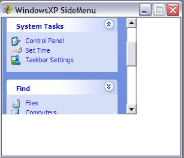



## WindowsXP SideMenu Final

### Description

This is the third and Final Release of this Project I hope you will some good things in this final release.

1. A vertical Scroll bar is added to scroll if there are more than one menus.

2. Contract and Expand Animations

3. Two menus used

4. Some bugs fixed

5. Compatible with Windows 98 as well as Windows XP(although there will be some difference in menu animation)

I have added all the things you guys suggested.

I hope this final version will be good enough for every one

The main thing I have done here is that the code is fully explained.

So enjoy it till my next submission.

bye & Take Care

Allah Hafiz
 
### More Info
 

             |
---                |---
**Submitted On**   |2002-05-21 23:16:38
**By**             |[Afaque Ahmed Memon](https://github.com/Planet-Source-Code/PSCIndex/blob/master/ByAuthor/afaque-ahmed-memon.md)
**Level**          |Beginner
**User Rating**    |4.4 (35 globes from 8 users)
**Compatibility**  |VB 6\.0
**Category**       |[Windows System Services](https://github.com/Planet-Source-Code/PSCIndex/blob/master/ByCategory/windows-system-services__1-35.md)
**World**          |[Visual Basic](https://github.com/Planet-Source-Code/PSCIndex/blob/master/ByWorld/visual-basic.md)
**Archive File**   |[WindowsXP\_856675212002\.zip](https://github.com/Planet-Source-Code/afaque-ahmed-memon-windowsxp-sidemenu-final__1-34990/archive/master.zip)

